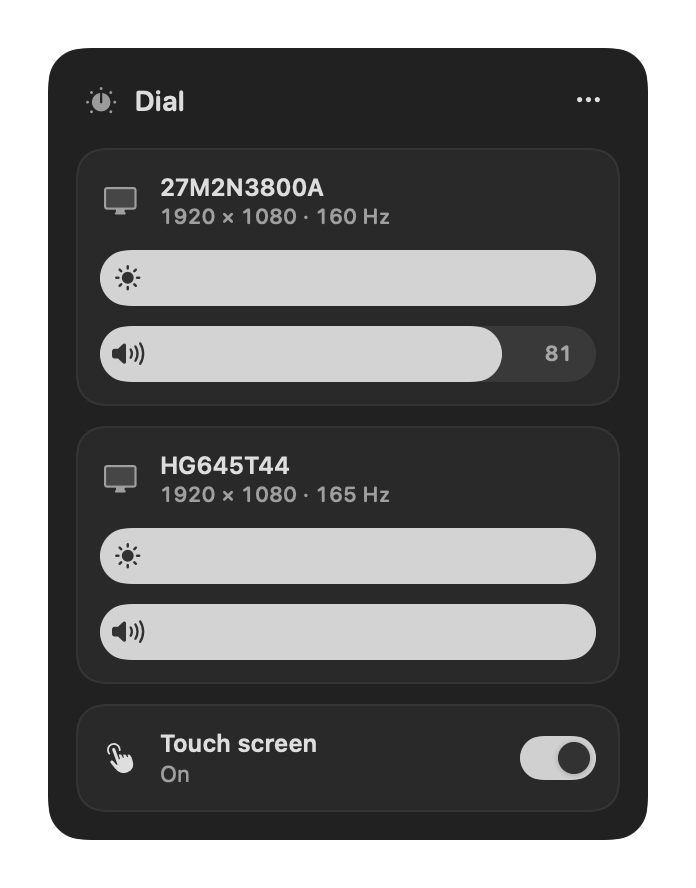

# Dial

A tiny menu-bar app for external monitors on Apple silicon Macs.

<p align="center">
  
</p>

- **Brightness & volume** for every external display, using the monitor's own hardware controls (DDC/CI) — no dimming overlays.
- **Keyboard keys** — brightness keys adjust the display under the pointer; volume keys adjust the monitor's speakers when it is the sound output. A small glass HUD shows the level.
- **Touch screen on/off** — USB touch monitors (UPERFECT, ASUS ZenScreen, …) can be switched off in one click, so a stray palm can't click things.

That's it. No accounts, no network, no settings window.

## Install

Requires macOS 14+ on Apple silicon and the Xcode Command Line Tools (`xcode-select --install`).

```bash
git clone https://github.com/melindaGh/dial.git
cd dial
./scripts/build-app.sh
open build/Dial.app
```

Move `build/Dial.app` to `/Applications` if you want to keep it, then turn on **Launch at login** from the `…` menu.

### Permissions

| Feature | Permission | Where |
| --- | --- | --- |
| Keyboard brightness/volume keys | Accessibility | System Settings → Privacy & Security → Accessibility |
| Touch screen on/off | Input Monitoring | System Settings → Privacy & Security → Input Monitoring |

Brightness and volume sliders need no permission.

## Command line

```bash
build/Dial.app/Contents/MacOS/Dial --probe                          # what Dial can see (for bug reports)
build/Dial.app/Contents/MacOS/Dial --set "HG645" brightness 40       # set a value from scripts
```

## How it works

- **DDC/CI** — monitors expose brightness (VCP `0x10`) and volume (`0x62`) over the video cable's I²C channel. On Apple silicon, Dial reaches it through the `IOAVService` API, pairing each display with its service by walking the IO registry. This works over USB-C/DisplayPort and the built-in HDMI port on recent Macs. Some monitors, docks and DisplayLink adapters don't pass DDC through.
- **Touch** — the touch panel is a separate USB HID device. Turning touch off opens it exclusively (`kIOHIDOptionsTypeSeizeDevice`), so macOS stops receiving its events; turning it on releases it.
- **Keys** — a session event tap catches the media keys and only swallows them when an external display should handle them.

## Limitations

- macOS does not let apps drive the built-in **Control Center** Display and Sound sliders for external monitors.
- Some monitors answer volume requests even without speakers.
- Builds are ad-hoc signed, so macOS asks for permissions again after each rebuild. Set `SIGN_IDENTITY` to a stable certificate to avoid that.
- Display scaling (HiDPI modes) is out of scope — use BetterDisplay for that.

## Credits

DDC on Apple silicon was pioneered by [MonitorControl](https://github.com/MonitorControl/MonitorControl) and [m1ddc](https://github.com/waydabber/m1ddc).

## License

MIT
