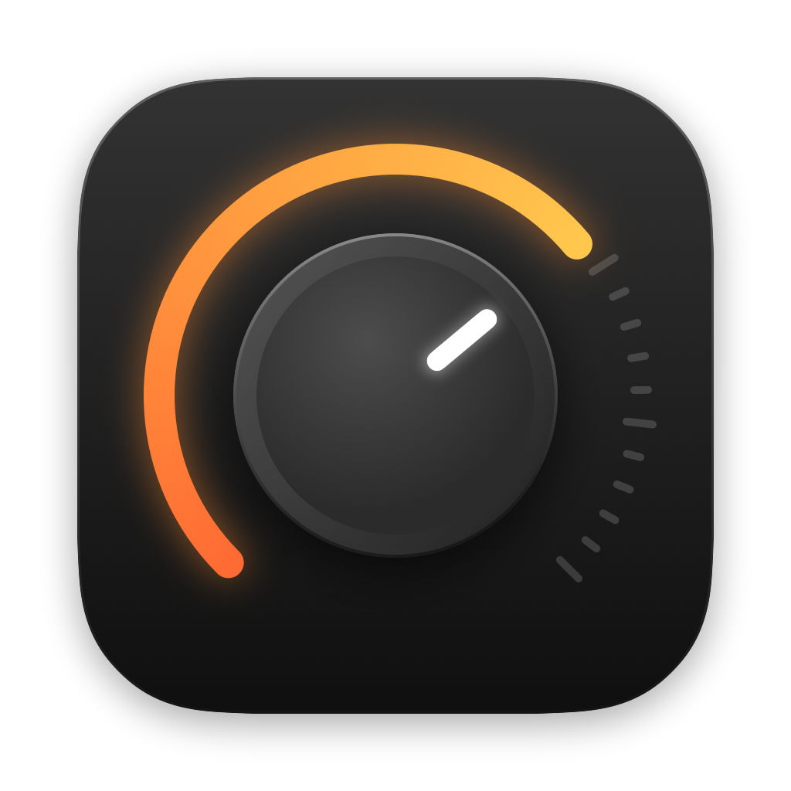
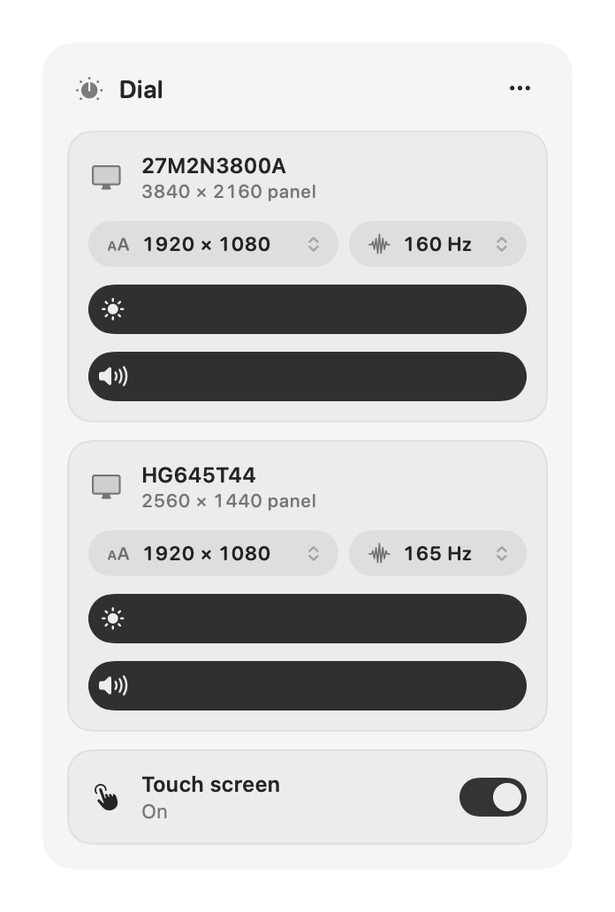

<p align="center">
  
</p>

<h1 align="center">Dial</h1>

<p align="center">
  <b>Brightness, volume, screen size and touch for your external monitors — right from the menu bar.</b>
</p>

<p align="center">
  <a href="https://github.com/Eroyun/dial/releases/latest/download/Dial.dmg">
    
  </a>
</p>

<p align="center">
  <a href="https://github.com/Eroyun/dial/actions/workflows/ci.yml"></a>
  <a href="https://github.com/Eroyun/dial/releases/latest"></a>
  
  
  <a href="LICENSE"></a>
</p>

<p align="center">
  <picture>
    <source media="(prefers-color-scheme: dark)" srcset="docs/panel-dark.png">
    
  </picture>
</p>

## What it does

- ☀️ **Brightness** — changes the monitor's real backlight. Screens that don't allow that (often behind adapters) get their picture dimmed instead.
- 🔊 **Volume** — for monitors with speakers.
- 🔍 **Screen size** — see your screen's real resolution, pick how big everything looks from a short list, and choose the refresh rate.
- ⌨️ **Keyboard keys** — your Mac's brightness and volume keys work on the monitor too.
- ✋ **Touch on/off** — turn a touch screen off so a stray hand can't click things.

No account, no internet, no settings to learn.

## Install — 4 steps, no Terminal

1. Click **[Download Dial](https://github.com/Eroyun/dial/releases/latest/download/Dial.dmg)**.
2. Open the downloaded **Dial.dmg** and drag **Dial** onto the **Applications** folder.
3. Open **Dial** from your Applications folder. The dial icon appears at the top of your screen, next to the clock.
4. Click the dial icon. That's it.

<details>
<summary><b>Mac says "Dial Not Opened" or "Apple could not verify"?</b></summary>

Dial is free and isn't sold through Apple, so macOS asks you to confirm once:

1. Click **Done** on the message.
2. Open **System Settings → Privacy & Security**.
3. Scroll down and click **Open Anyway** next to Dial, then enter your Mac password.

You only do this once.
</details>

## Turning on keys and touch control

Brightness, volume and screen size work right away. Click **Set Up** on the **Keyboard keys** card (or turn touch off), and Dial opens System Settings for you:

1. Turn on the switch next to **Dial**.
2. That's it. Dial notices by itself, the keys work from then on, and the card goes away.

## Questions

**Can I use Control Center instead?**
No. Apple doesn't let apps add external-monitor sliders to Control Center, so Dial lives in the menu bar instead.

**Brightness on one monitor only makes the picture darker.**
That monitor, or the adapter it's on, blocks the signal Dial uses to set the backlight, so Dial dims the picture instead. Connecting it straight to the Mac with USB-C or HDMI often gets real backlight control back.

**I want more screen sizes than the list shows.**
Dial shows every size macOS offers for your monitor (when a size comes both sharp and blurry, only the sharp one). Adding new sizes needs deeper system changes; [BetterDisplay](https://github.com/waydabber/BetterDisplay) does that.

**How do I make Dial start with my Mac?**
Right-click the dial icon and choose **Open at Login**.

## For developers

```bash
git clone https://github.com/Eroyun/dial.git && cd dial
./scripts/build-app.sh --install   # builds Dial and puts it in Applications (needs Xcode Command Line Tools)
/Applications/Dial.app/Contents/MacOS/Dial --probe   # what Dial sees, for bug reports
```

How it works:
- **Brightness and volume** use DDC/CI, which is the monitor's own control channel over the video cable. On Apple silicon it goes through `IOAVService`, and each screen is matched to its channel through the IO registry.
- **Screen size** switches between the display modes macOS reports, using `CGConfigureDisplayWithDisplayMode`.
- **Touch off** seizes the touch panel's USB HID device. It also drops pointer events sent by that panel at the HID event tap.

See [CONTRIBUTING.md](CONTRIBUTING.md) to help out.

## Credits

DDC on Apple silicon was pioneered by [MonitorControl](https://github.com/MonitorControl/MonitorControl) and [m1ddc](https://github.com/waydabber/m1ddc).

## License

[MIT](LICENSE)
